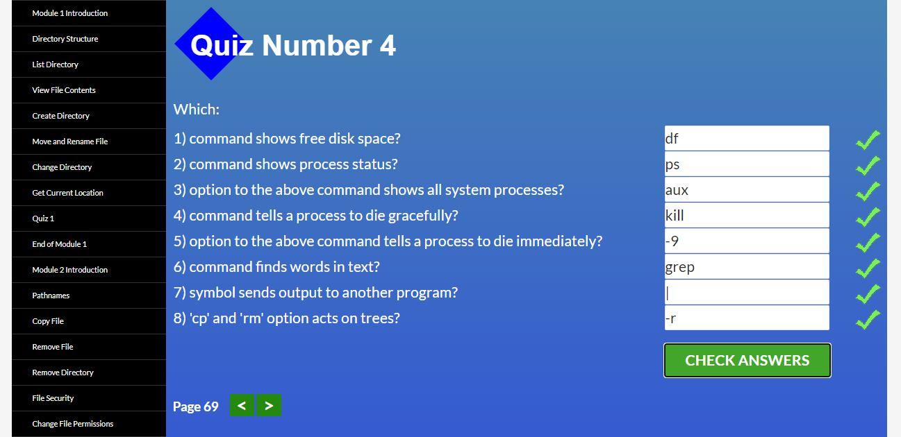
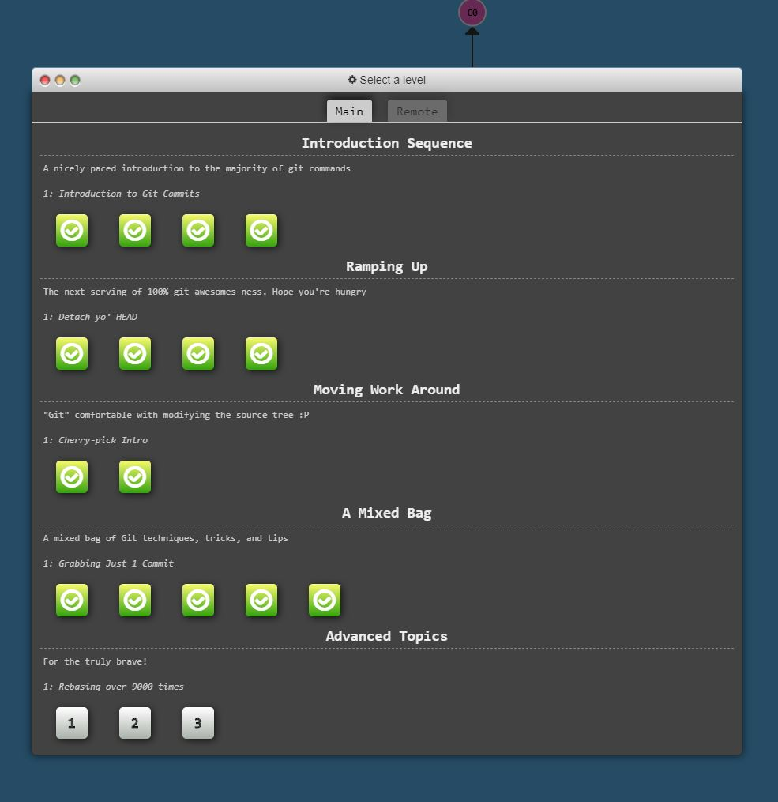
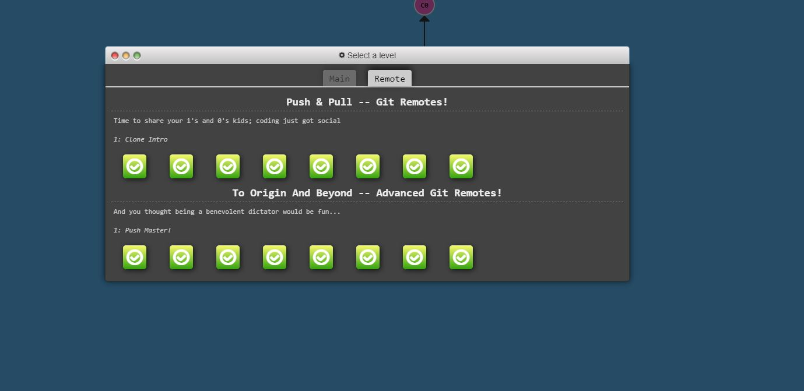
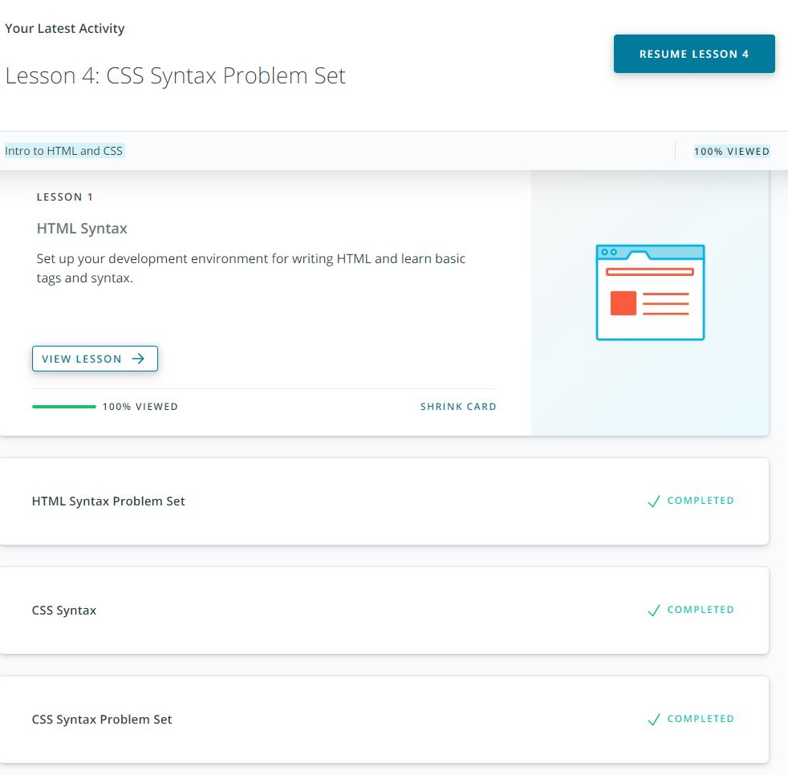
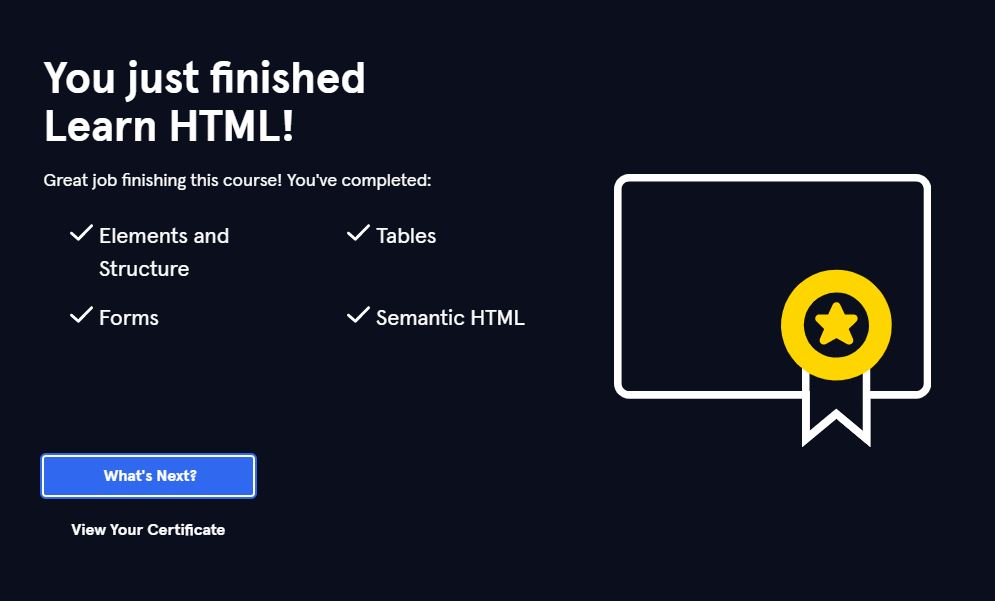
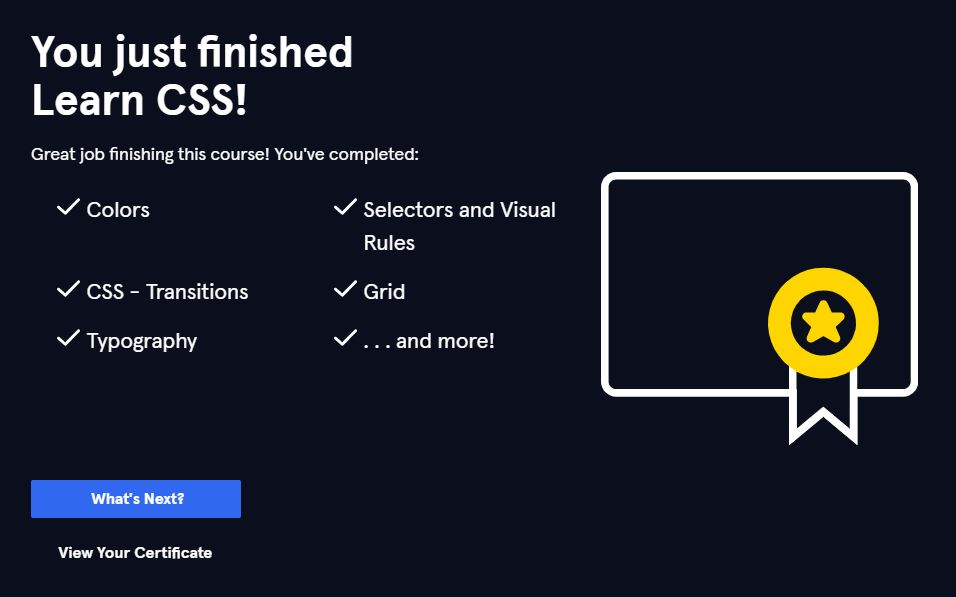

# Self-Study part of Front-End Course by [kottans](https://kottans.org/)
 
## Git Basics

1) The course [Version Control with Git](https://www.udacity.com/course/version-control-with-git--ud123) finished  
The course gives a clear understanding of version control system, git's basic concepts and provides many exercises to understand the core git's commands.

2) Levels 'Main: Introduction Sequence' and 'Remote: Push & Pull -- Git Remotes' at [learngitbranching.js.org](https://learngitbranching.js.org/) completed  
Great mix of theory and practice for beginners

## Linux CLI, and HTTP

 
 

## Git Collaboration

 
 
**what was new:** cherry-pick command 
**what surprised:** additional arguments <source:destination> for push/fetch/pull commands 
**what can be used in future:** interactive mode for rebase, cherry-pick command 

## Intro to HTML and CSS

 
**what was new:** layout with Flexbox, Grid Template 
**what surprised:** relative units - fr, css transitions 
**what can be used in future:** grid, of course :) 

### Additional info

➡️ Read course plan in [Course Contents](https://github.com/kottans/frontend/blob/master/contents.md)
